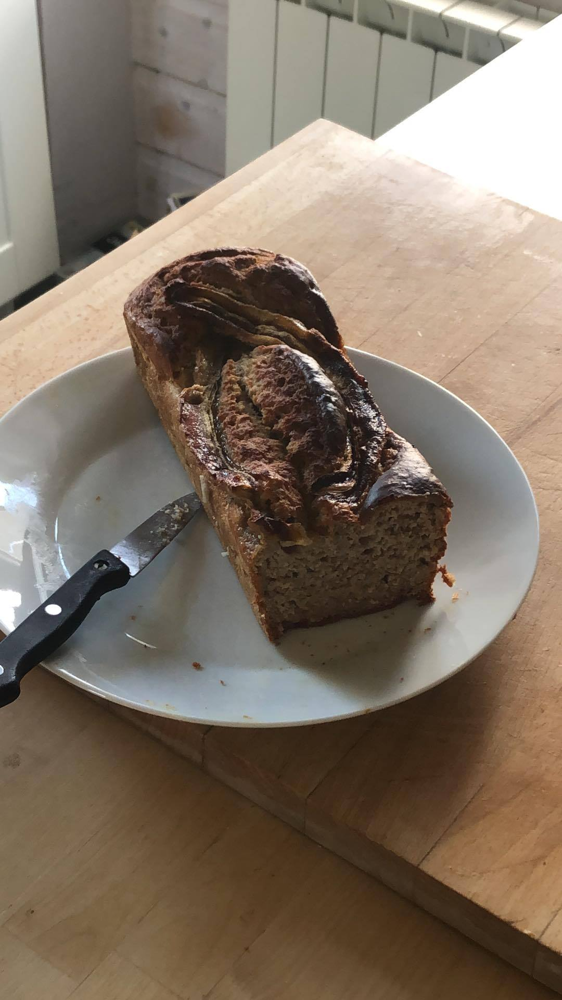

# "Banana bread"

| Auteur         | Date           | Info  |
| -------------- |:--------------:| ----- |
| Cam            | 06/05/2020     | ajout |
|                |                |       |

___

## Ingrédients

*pour 1 gâteau*

| Ingrédients               | Quantité     | Unité
|:-------------------------:|-------------:|-------
| Bananes bien mûres        |            3 |
| Farine semi-complète      |          175 | g
| Sirop d'agave (ou sucre)  |           10 | cl
| Huile de coco (ou beurre) |           30 | g
| Lait d'amande (ou normal) |           15 | cl
| Poudre d'amandes          |          100 | g
| Levure chimique           |            5 | g
| Oeufs                     |            3 |

___

## Préparation

1. Mettre de côté une des bananes 
2. Mélanger l'ensemble des ingrédients en remuant bien afin d'éviter les grumeaux
3. Verser la pâte dans un moule cake et déposer sur le dessus la banane coupée en 2 dans sa longueur
4. Enfourner à 180 degrés pendant 40 minutes (vérifier la cuisson en plantant la lame d'un couteau, tu connais!)
5. A déguster au petit-déjeuner ou comme encas avant une séance de sport (ça motiverait presque à en faire)

_Plus les bananes sont mûres, meilleur c'est!_

___

### [Revenir aux desserts](https://github.com/fookinhell/TopChefCrew-Recipes/wiki/Desserts)

### [Revenir au sommaire](https://github.com/fookinhell/TopChefCrew-Recipes/wiki)
