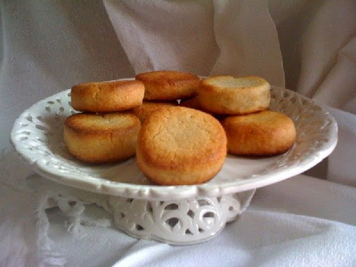

# Macarons d'Amiens

| Auteur         | Date           | Info  |
| -------------- |:--------------:| -----:|
| Flo            |  05/05/20      | ajout |

___

## Ingrédients

*pour environ 20 macarons*

| Ingrédients                        | Quantité  | Unité
|:----------------------------------:|----------:|-------
| Poudre d'amandes (1)               |       250 | g
| Sucre en poudre (1)                |       200 | g
| Jaune d'œuf (1)                    |         1 |
| Vanille en poudre (1)              |         1 | c.à.c.
| Blancs d'œufs (2)                  |         2 |
| *Gelée d'abricot ou de pomme* (2)  |         1 | c.à.s.
| Extrait amande amère (2)           |         1 | c.à.c.

___

## Préparation

* Mélanger tous les ingredients notés (1) pour former une pâte
* Ajouter ensuite les ingrédients en (2)
* Faire reposer la pâte au frigo pendant au moins 1h
* Faire un boudin de 4 cm de diamètre environ et couper des tranches de 2 cm d'épaisseur
* Disposez-les tranches sur une plaque recouverte d'une feuille de papier sulfurisé
* Faire cuire 15 min à th. 4 (120°)

___

### [Revenir aux desserts](https://github.com/fookinhell/TopChefCrew-Recipes/wiki/Desserts)

### [Revenir au sommaire](https://github.com/fookinhell/TopChefCrew-Recipes/wiki)
