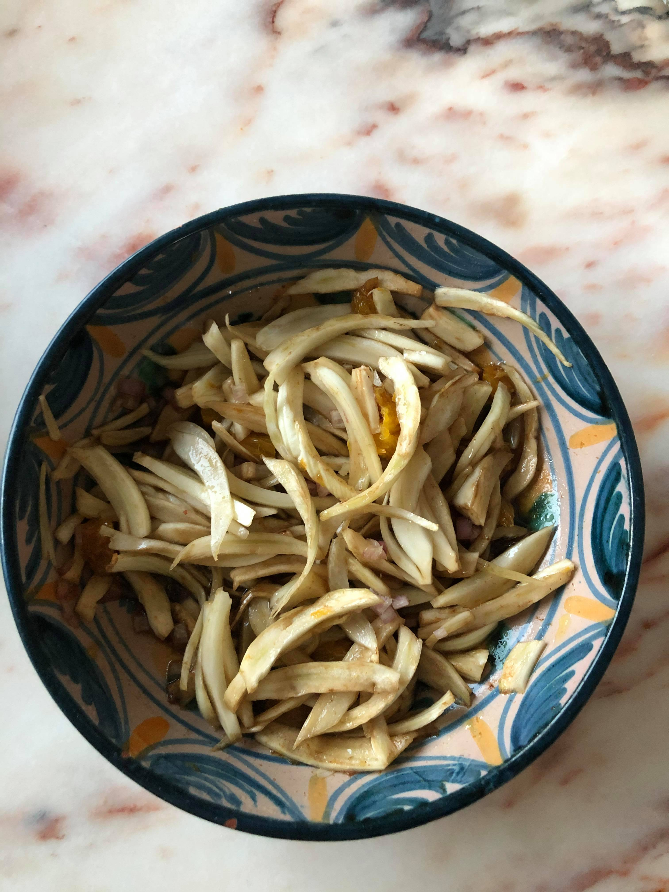

# "Salade de fenouil"

<!-- me transmettre une photo (jpg, png, etc) pour que je la mette ici -->

| Auteur         | Date           | Info  |
| -------------- |:--------------:| ----- |
| Cam            | 06/05/2020     | ajout |
|                |                |       |

___

## Ingrédients

*pour 4 personnes*

| Ingrédients               | Quantité     | Unité
|:-------------------------:|-------------:|-------
| Fenouil                   |            2 |
| Orange                    |            1 |
| Echalote                  |            1 |
| Vinaigre balsamique       |            1 | c.à.s.
| Huile d'olive             |            1 | c.à.s.
| Cumin                     |            1 | pincée

___

## Préparation

1. Couper le bulbe de fenouil en julienne
2. Lever les suprêmes de la première moitié de l'orange 
3. _Pour la vinaigrette_ : mélanger le jus de la deuxième moitié de l'orange, le vinaigre balsamique, l'huile d'olive, le cumin, le sel et le poivre
4. Assembler les différents éléments dans un joli plat

_Cette salade accompagnera parfaitement un bon barbecue_
