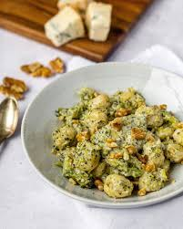

# Gnocchi brocolis et crème de gorgonzola

| Auteur         | Date           | Info  |
| -------------- |:--------------:| ----- |
| Lilou          | 9 Mai          | ajout |
|                |                |       |

___

## Ingrédients

*pour 2 Personnes*

| Ingrédients               | Quantité     | Unité
|:-------------------------:|-------------:|-------
| Gnocchi                   |           250| g
| Brocoli cuit vapeur    |           150| g
| Ail             |            1 | gousse
| Crème liquide  |            100 |ml 
| Gorgonzola |            30 | g
| Noix concassées |            4 | 
| Sel & poivre|            | 

___

## Préparation

* Cuire pendant 3 minutes mes gnocchi dans de l’eau. Égoutter
* Peler et hacher la gousse d’ail, la faire revenir dans une poêle avec un filet d’huile d’olive. * Ajouter les gnocchis, faire rissoler et ajouter le brocolis cuits vapeur.
* Ajouter la crème liquide, le gorgonzola, mélanger le tout, saler, poivrer et ajouter des noix.
