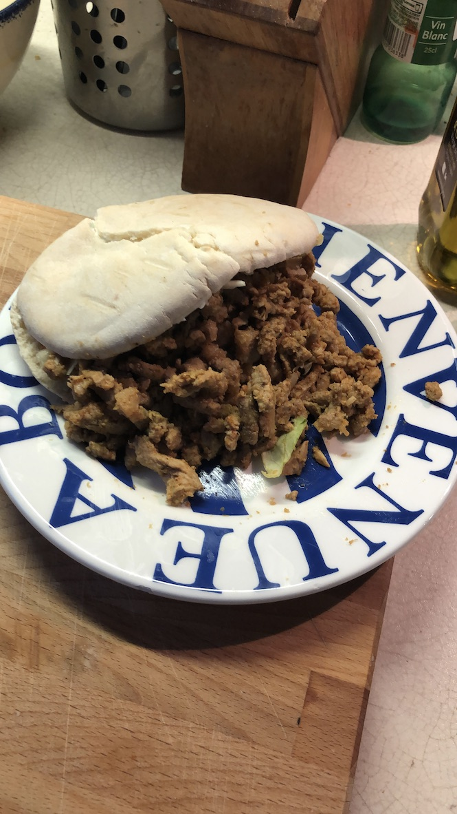

# Le Kebz

| Auteur         | Date           | Info  |
| -------------- |:--------------:| ----- |
|   Ben-J        |   10/05/2020   | ajout |
|                |                |       |

___

## Ingrédients

*pour 2 personnes*

| Ingrédients                  | Quantité     | Unité
|:----------------------------:|-------------:|-------
| Poitrine de veau             |           200| g
| Quasi de veau                |           200| g
| _sinon escalopes_            |           400| g
| Yaourt grec                  |            1 |
| Oignons                      |            1 |
| Paprika doux                 |            1 | pincée
| _Piment_                     |            1 | pincée
| Cumin                        |            1 | pincée
| Sel                          |            1 | cuillère à café
| Poivre                       |            1 | cuillère à café
| Pain Pita/Galette            |            2 | par pers
| Crudités (S/T/O)             |              |

___

## Préparation

#### Marinade

1. Avec un couteau bien aiguisé, couper votre veau en tranche très fines (pas besoin que ce soit propre juste bien fin)
2. Dans un mixer, ajouter le yaourt grec et l'oignon grossièrement coupé, bien mixer.
3. Ajouter les épices, sel, poivre et mixer de nouveau (ajuster l'assaisonnement al gusto)
4. Dans un saladier verser la marinade ainsi obtenu, ajouter la viande et bien mélanger

#### Montage de la "Broche"

1. Etaler sur une surface assez de film étirable pour faire une ballottine avec votre tas de viande
2. Empiler une par une les tranches de viande, toujours dans le même sens. Ça va former une montagne.
    * Toujours dans le même sens pour que lors de la coupe, ça fasse des petits bouts comme au kebz ;)
3. On ferme le film et on fait une ballottine (bien serré)
4. C'est parti pour un séjour au congélateur
    * L'idée ici c'est que notre viande se tienne, que ce soit plus simple à couper. Le temps peut varier. On peut le faire la veille pour le lendemain mais faudra pas oublier de sortir la viande un peu avant que ça décongèle un peu.
  
#### Chef Kebabier

1. La viande se tient bien, on enlève le film et on coupe comme si c'était un saucisson, les petits bouts de kebab se forment
2. Dans une sauteuse, sans matière grasses, bien chaude, on envoi la viande et on laisse cuire jusqu'a coloration
3. On prend son pain ou sa galette, on met une bonne dose de @La Sauce Blanche comme au kebz, les crudités, et la viande cuites.
4. On dégomme ça et on recommence <3

___

### [Revenir aux plats](https://github.com/fookinhell/TopChefCrew-Recipes/wiki/Plats)

### [Revenir au sommaire](https://github.com/fookinhell/TopChefCrew-Recipes/wiki)
