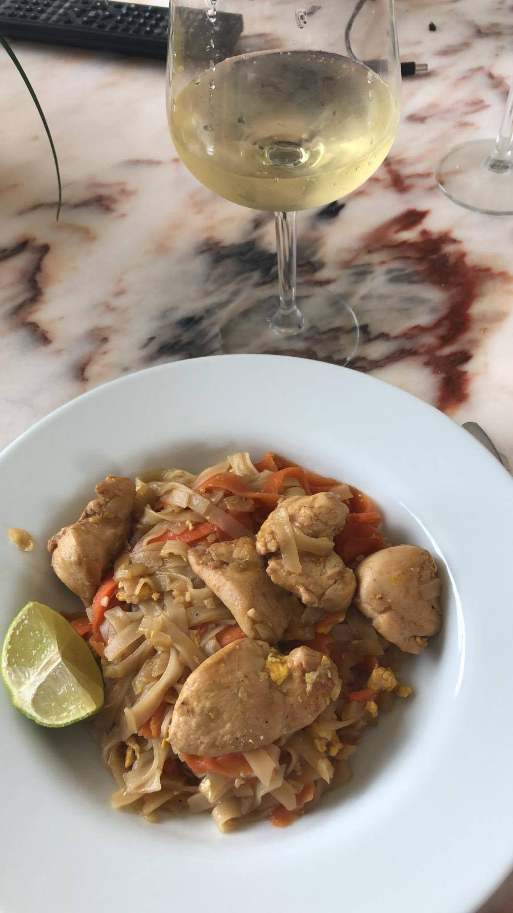

# Pad Thaï

| Auteur         | Date           | Info  |
| -------------- |:--------------:| ----- |
| Cam            |  07/05/2020    | ajout |
|                |                |       |

___

## Ingrédients

*pour 2 personnes 

| Ingrédients            	    | Quantité     | Unité
|:---------------------------------:|-------------:|-------
| Filets de poulet (ou crevettes ou tofu)|       2 | 
| Oeuf                   	    |            1 | 
| Nouilles de riz         	    |            1 | paquet
| Carottes                 	    |            2 | 
| Oignons blancs           	    |            1 | 
| Gousse d'ail            	    |            3 |
| Gingembre frai         	    |            1 | pouce 
| Citron vert              	    |            1 |
| Cacahuètes non salées   	    |            1 | poignée
| Sauce soja salé                   |            1 | c.à.s
| Tamarin (ou Vinaigre balsamique)  |          1,5 | c.à.s 
| Sauce Nuoc Man         	    |            3 | c.à.s 
| Bouillon de légumes    	    |          1/4 | tasse 
| Paprika 

___

## Préparation

1. Détailler le poulet (ou les crevettes ou le tofu) en petit cube et le faire mariner au moins 1h dans de la sauce soja et du paprika
2. Faire bouillir une casserole d’eau 
3. Couper tous les ingrédients :
    * les carottes en tagliatelles à l'aide d'un économe 
    * les oignons blancs, l'ail et le gingembre en tout petits bouts
4. Préparer la sauce en mélangeant la sauce soja, le tamarin (ou vinaigre balsamique), la sauce Nuoc man, le bouillon de légumes et le jus d'un demi citron vert
5. Mettre les nouilles de riz dans l’eau bouillante (casserole hors du feu) 3/4 minutes et les passer sous l’eau froide pour stopper la cuisson 
6. Idem pour les carottes 
7. Dans un peu d’huile faire revenir l'oignon, l'ail et le gingembre 
8. Puis y ajouter le poulet, faire revenir quelques minutes 
9. Mettre les aliments d’un côté de la poêle et casser l’œuf pour en faire un œuf brouillé 
10. Ajouter dans la poêle les nouilles, les carottes et la moitié de la sauce 
11. Laisser cuire quelques minutes en ajoutant régulièrement le reste de sauce 
12. Servir avec les cacahuètes concassées et le citron vert 
