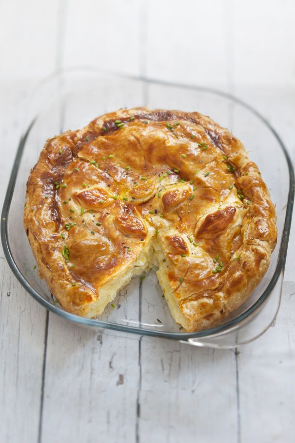

# Pâté bourbonnais

TODO : PRENDRE PHOTO PERSO

| Auteur         | Date           | Info  |
| -------------- |:--------------:| ----- |
| Flo            | 05/05/20       | ajout |

___

## Ingrédients

*pour X personnes*

| Ingrédients             | Quantité     | Unité
|:-----------------------:|-------------:|-------
| Pâte feuilletée         |            2 |
| Pommes de terre         |      400-500 | g
| Oignon                  |            1 |
| *Échalotes*             |          1-2 |
| Gousse d'ail            |            1 |
| Persil plat             |            1 | c.à.s.
| Thym                    |            1 | brindille
| Crème fraîche épaisse   |           20 | cl

___

## Préparation

* Pour le choix des pommes de terre, en prendre des pas trop grosses (belles de Fontenay, charlottes...), éviter les rattes ou autres pdt trop fermes
* Poser sur la tôle une des pâtes feuilletées (avec son papier) en laissant déborder le surplus, piqueter le fond avec une fourchette jusqu’à 2 cm des bords, mettre au réfrigérateur au moins 1/2 heure. Découper dans l'autre pâte feuilletée un cercle de 22 cm environ de diamètre, le mettre également au réfrigérateur. 
* Hacher finement au couteau oignon et ail, ciseler le persil, bien mélanger.
* Préchauffer le four à 200°. 
* Eplucher les pommes de terre, les laver, les essuyer, les couper en fines rondelles. En étaler la moitié jusqu’à 2 cm des bords, saler, poivrer, répartir la moitié du mélange oignon/ail/persil. Procéder de même pour la seconde couche en formant un léger dôme. Ajouter une brindille de thym. Poser l’abaisse du dessus ajustée aux bonnes dimensions, former un bourrelet avec le surplus de pâte de l'abaisse du fond. Avec le plat d'un couteau, chiqueter cette abaisse si elle est en pâte feuilletée (en biais, tous les 2 ou 3 cm). Dorer avec un œuf battu mélangé à un peu d’eau (je préfère passer un coton imbibé de lait, la dorure est plus naturelle, moins brillante). Tracer des croisillons avec le plat d’un couteau. 
* Enfourner. Faire cuire 25 min à 200°. Baisser à 180° quand le dessus devient doré, faire cuire encore une quinzaine de minutes. Sortir le pâté du four, découper un grand couvercle au ras du bourrelet, l’enlever, vérifier la cuissondes pommes de terre avec la pointe d'un couteau, enlever le thym, verser la crème fraîche, l'étaler délicatement sur les pommes de terre, reposer le couvercle, faire cuire encore une dizaine de minutes. 
* Le pâté aux pommes de terre est généralementservi tiède ou chaud en entrée ou le soir avec une salade verte. On peut le faire cuire quelques heures avant de le servir et le faire réchauffer doucement. Mais il peut aussi se manger froid aux repas ou en casse-croûte.

___

### [Revenir aux plats](https://github.com/fookinhell/TopChefCrew-Recipes/wiki/Plats)

### [Revenir au sommaire](https://github.com/fookinhell/TopChefCrew-Recipes/wiki)